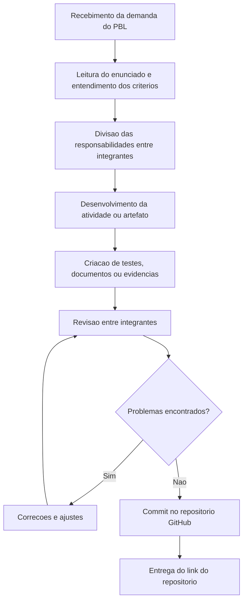

# Aula 14 - Qualidade de Processo

*Disciplina:* Qualidade de Software  
*Projeto:* LocalEats  
*Integrantes do grupo:*

* Vinicius Ortiz
* Augusto Martins
* Erick Rodrigues

---

## 1. Objetivo

Analisar o processo utilizado pela equipe para desenvolver, validar e entregar atividades relacionadas ao LocalEats. O foco desta atividade nao e testar uma funcionalidade especifica, mas entender como o trabalho e organizado e como a qualidade pode ser incorporada ao fluxo.

---

## 2. Divisao por Integrante

| Integrante | Responsabilidade |
|---|---|
| Vinicius Ortiz | Mapeamento do processo atual |
| Augusto Martins | Identificacao de entradas, atividades e saidas |
| Erick Rodrigues | Reflexao critica e propostas de melhoria |

---

## 3. Mapeamento do Processo Atual

O processo atual da equipe segue um fluxo simples, baseado nas demandas dos PBLs e na entrega final pelo GitHub.

### 3.1 Descricao do Fluxo

1. A demanda e recebida a partir do documento do PBL.
2. A equipe interpreta o enunciado e identifica os criterios avaliados.
3. As responsabilidades sao divididas entre Vinicius, Augusto e Erick.
4. Cada integrante produz sua parte, como documento, teste, cenario ou analise.
5. Os artefatos sao revisados antes da entrega.
6. Caso algum problema seja encontrado, a equipe corrige e revisa novamente.
7. A entrega e registrada no repositorio GitHub.

---

## 4. Entradas, Atividades e Saidas

| Etapa | Entrada | Atividade | Saida |
|---|---|---|---|
| Recebimento da demanda | Documento do PBL e orientacoes do professor | Ler o enunciado e identificar o que precisa ser entregue | Lista de tarefas e criterios de avaliacao |
| Planejamento | Tarefas identificadas | Dividir responsabilidades entre integrantes | Responsaveis definidos por parte da atividade |
| Desenvolvimento | Requisitos da atividade | Criar documentos, testes, codigo ou cenarios | Artefatos iniciais da entrega |
| Testes e validacao | Codigo, testes e documentos criados | Executar testes, revisar conteudo e conferir criterios | Evidencias de validacao e lista de ajustes |
| Correcoes | Problemas encontrados na revisao | Ajustar textos, codigo, testes ou estrutura do repositorio | Versao corrigida dos artefatos |
| Versionamento | Artefatos finalizados | Realizar commit e organizar arquivos no GitHub | Historico versionado no repositorio |
| Entrega | Repositorio atualizado | Enviar link do repositorio | Entrega disponivel para avaliacao |

---

## 5. Reflexao sobre o Processo

### 5.1 O processo utilizado pela equipe esta claramente definido?

Parcialmente. A equipe ja possui um fluxo pratico: entender o PBL, dividir as partes, produzir os artefatos e publicar no GitHub. Porem, o processo ainda pode ser mais formalizado com criterios de pronto, revisao padronizada e indicadores de qualidade.

### 5.2 Todos os integrantes seguem o mesmo fluxo de trabalho?

Em geral, sim. Todos trabalham a partir dos mesmos enunciados e entregam no mesmo repositorio. A diferenca e que algumas atividades exigem codigo e outras exigem analise textual, entao o nivel de validacao pode variar.

### 5.3 Em quais etapas a qualidade e verificada?

A qualidade e verificada principalmente durante a revisao dos documentos, execucao dos testes automatizados e organizacao final dos arquivos no repositorio. A partir dos PBLs 6, 7 e 8, a equipe tambem passou a validar qualidade por meio de Pytest, Playwright e BDD.

### 5.4 Quais melhorias poderiam tornar o processo mais eficiente?

* Criar checklist antes de cada entrega.
* Usar Issues para registrar tarefas e defeitos.
* Usar GitHub Actions para executar testes automaticamente.
* Definir Definition of Ready e Definition of Done para cada atividade.
* Manter um historico de metricas, como testes executados e falhas encontradas.

### 5.5 Como a qualidade do processo impacta a qualidade do produto final?

Um processo bem definido reduz retrabalho, evita esquecimentos e aumenta a confiabilidade das entregas. Quando a equipe sabe quais etapas seguir, fica mais facil identificar defeitos cedo, documentar decisoes e manter evidencias de qualidade.

---

## 6. Conclusao

O processo atual da equipe e funcional, mas ainda esta em evolucao. A organizacao no GitHub, os testes automatizados e a divisao por integrante ja contribuem para a qualidade. Como melhoria, a equipe deve formalizar criterios de entrada e saida, registrar defeitos com mais consistencia e usar automacao de qualidade para reduzir verificacoes manuais.

